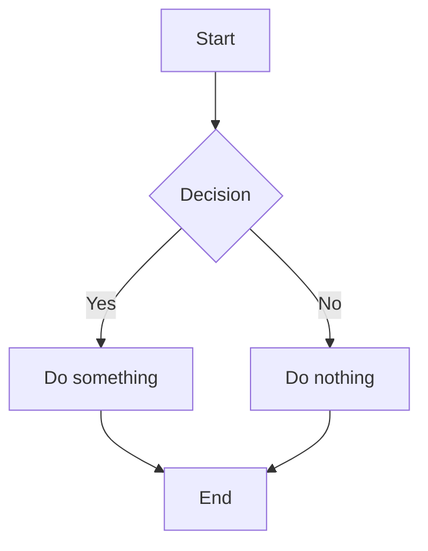

# EventTemplates
You may find the details of the description of these 4 classes in https://a5w1h.blogspot.com/2025/06/event-handlers-in-c-journey-from.html.
And https://a5w1h.blogspot.com/2025/06/building-on-event-handlers-implementing.html.

#testing for flowchart generating

